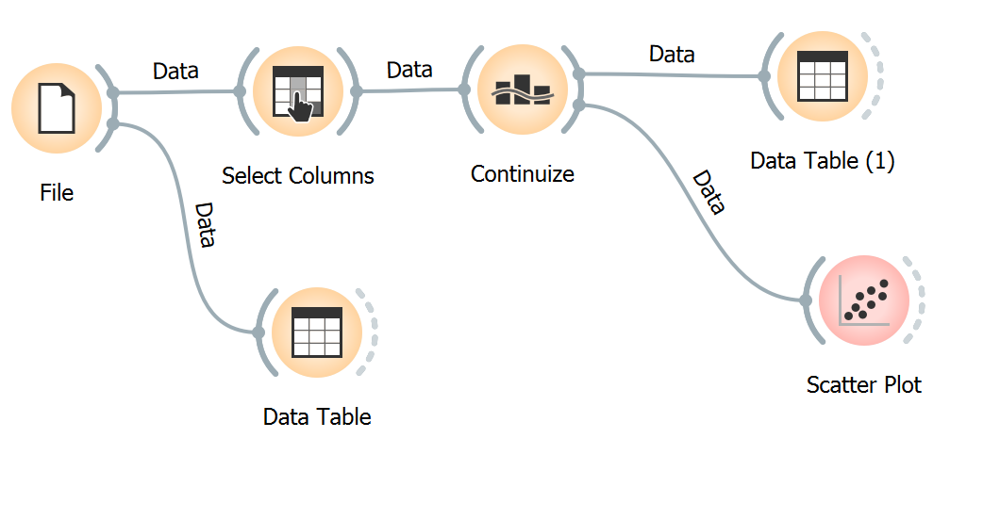

# Projeto Orange / Regras de Associação para Foodmart

## Imagem do Projeto

## Arquivo do Projeto
[Link para Projeto Orange](orange/foodMarketAssociation.ows)

# Projeto Orange / Análise de Dados do Google PlayStore

## Imagem do Projeto

## Arquivo do Projeto
[Link para Projeto Orange](orange/GooglePlay.ows)

## Gráfico(s) de Análise
*As categorias foram convertidas em numeros inteiros para geracao do grafico

# Projeto de Composição de Componentes para Recomendação

> Imagem (`PNG`) do diagrama de componentes (veja exemplos abaixo).

# Projeto de Composição de Componentes para Pedido

## Diagrama de Componentes

> Imagem (`PNG`) do diagrama de componentes do pedido de um produto (veja exemplos abaixo).

## Diagrama de Interfaces

> Imagem (`PNG`) do detalhamento de interfaces referentes aos componentes.

## `Exemplos de Diagramas de Componentes`

### `Exemplo 1`

Este é o diagrama compondo componentes para análise:

### `Exemplo 2`

Este é um diagrama inicial do projeto de jogos:

### `Exemplo do Diagrama de Interfaces`

Interfaces associadas a esse componente:

