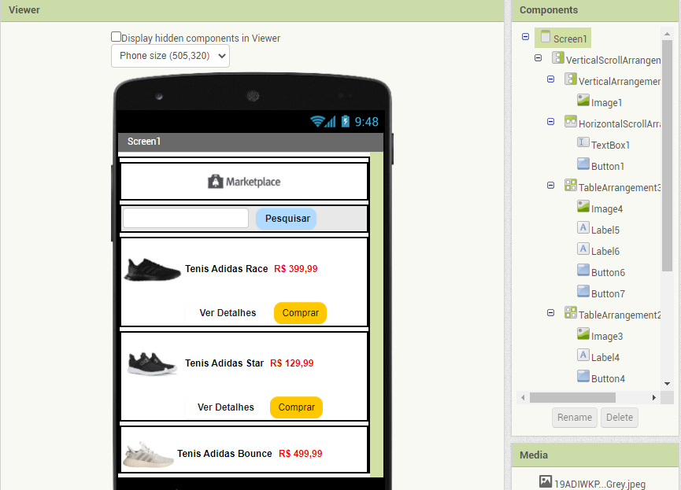

# Orquestração e Coreografia

## Tarefa 1

## Tarefa 2

## Tarefa 3

[Link Para o app](app/INF331.aia)
## Tarefa 4

[Link Para a Tarefa 4 ](https://github.com/INF331-Grupo3/tarefa4/blob/master/README.md)
