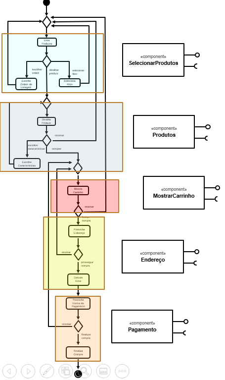
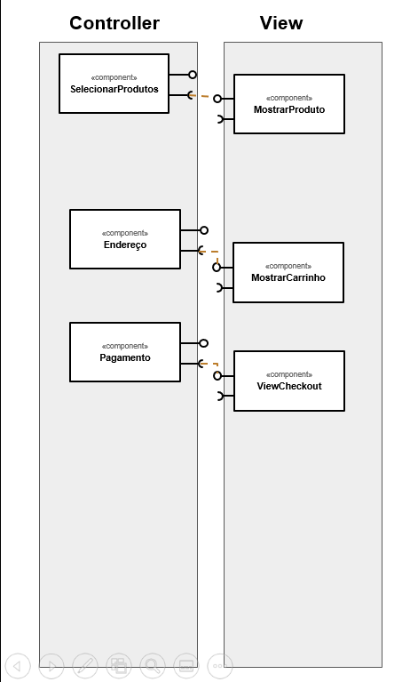
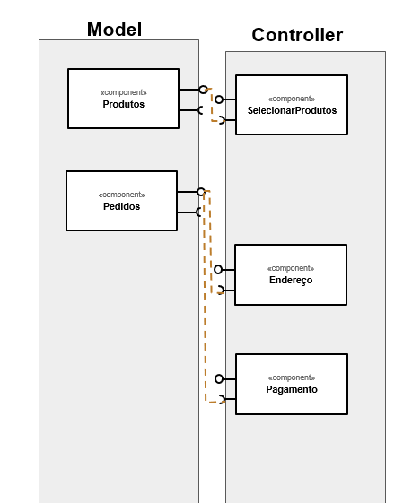

## Tarefa 1
*Componentes de Negócio*

## Tarefa 2
*Componentes Técnicos*

## Tarefa 3
*Componentes Técnicos*

## Tarefa 4

Encontre dois serviços REST interessantes, que recebam no mínimo dois parâmetros e execute pelo menos uma consulta em cada um deles. Apresente para cada serviço que você escolheu:
* Título do serviço : ODWeather
* URI do serviço: https://api.oceandrivers.com/v1.0/getEasyWind/EW013/?period=latestdata

* Descrição do serviço: Este serviço oferece as ultimas informações do tempo colhidas pela estação de tempo da EasyWind.

* Cabeçalho HTTP da requisição:
~~~~
:authority: any-api.com:8443
:method: GET
:path: /http://api.oceandrivers.com/v1.0/getEasyWind/EW013/?period=latestdata
:scheme: https
accept: application/json
accept-encoding: gzip, deflate, br
accept-language: pt-BR,pt;q=0.9,en-US;q=0.8,en;q=0.7
origin: https://any-api.com
referer: https://any-api.com/oceandrivers_com/oceandrivers_com/console/ODWeather/getEasywind
sec-fetch-dest: empty
sec-fetch-mode: cors
sec-fetch-site: same-site
user-agent: Mozilla/5.0 (Windows NT 10.0; Win64; x64) AppleWebKit/537.36 (KHTML, like Gecko) Chrome/84.0.4147.135 Safari/537.36
~~~~

* Cabeçalho HTTP da resposta:

~~~~
Access-Control-Allow-Headers: x-requested-with, Content-Type, origin, authorization, accept, client-security-token
Access-Control-Allow-Methods: POST, GET, OPTIONS, DELETE, PUT
Access-Control-Allow-Origin: *
Access-Control-Max-Age: 1000
Connection: Keep-Alive
Content-Length: 290
Content-Type: application/json
Date: Sun, 23 Aug 2020 20:31:32 GMT
Keep-Alive: timeout=5, max=100
Server: Apache
~~~~
* Resposta:
~~~json
{"TEMPERATURE": 27, 
"TWD": 141, 
"TWS": 5.0492, 
"TWS_GUST": 5.0492, 
"HUMIDEX": 68, 
"LONGITUDE": 2.63437166667, 
"PRESSURE": 1011, 
"TIME_STRING": "2019-08-01 15:46:13", 
"NAME": "Race committee 2", 
"TIME": 1564674373.0, 
"LATITUDE": 39.5668983333, 
"ACTIVE": "OFF", 
"ID": "EW013", 
"LOCALTIME": 2}
~~~
 
 
* Título do serviço : PUNK API
* URI do serviço: https://api.punkapi.com/v2/beers/?food=pizza

* Descrição do serviço: Serviço que retorna a receita de cervejas que combinam com um tipo de comida especificado no request.

* Cabeçalho HTTP da requisição:
~~~
:authority: api.punkapi.com
:method: GET
:path: /v2/beers/?food=pizza
:scheme: https
accept: text/html,application/xhtml+xml,application/xml;q=0.9,image/webp,image/apng,*/*;q=0.8,application/signed-exchange;v=b3;q=0.9
accept-encoding: gzip, deflate, br
accept-language: pt-BR,pt;q=0.9,en-US;q=0.8,en;q=0.7
cookie: __cfduid=d4ff76c9151e7db8133f837ab05ccb2c21598215800
sec-fetch-dest: document
sec-fetch-mode: navigate
sec-fetch-site: none
sec-fetch-user: ?1
upgrade-insecure-requests: 1
user-agent: Mozilla/5.0 (Windows NT 10.0; Win64; x64) AppleWebKit/537.36 (KHTML, like Gecko) Chrome/84.0.4147.135 Safari/537.36
~~~~
* Cabeçalho HTTP da resposta:
~~~
access-control-allow-credentials: true
access-control-allow-origin: *
access-control-expose-headers: x-ratelimit-limit,x-ratelimit-remaining,content-length,origin,content-type,accept
cache-control: public, max-age=14400, must-revalidate
cf-cache-status: MISS
cf-ray: 5c77be018fb0eeba-GRU
cf-request-id: 04beb514f10000eebaa139a200000001
content-encoding: br
content-type: application/json; charset=utf-8
date: Sun, 23 Aug 2020 20:56:47 GMT
etag: W/"32d6-TV91rkJmOlDomslSWSTPcuOjtSE"
expect-ct: max-age=604800, report-uri="https://report-uri.cloudflare.com/cdn-cgi/beacon/expect-ct"
server: cloudflare
status: 200
strict-transport-security: max-age=15552000; includeSubDomains
vary: Accept-Encoding
x-content-type-options: nosniff
x-dns-prefetch-control: off
x-download-options: noopen
x-frame-options: SAMEORIGIN
x-ratelimit-limit: 3600
x-ratelimit-remaining: 3402
x-ratelimit-reset: 1598218971
x-vercel-cache: MISS
x-vercel-id: gru1::sfo1::ngwmp-1598216207629-a953f0c16124
x-xss-protection: 1; mode=block
~~~
* Resposta:
~~~json
[
    {
        "id": 13,
        "name": "Movember",
        "tagline": "Moustache-Worthy Beer.",
        "first_brewed": "11/2009",
        "description": "A deliciously robust, black malted beer with a decadent dark, dry cocoa flavour that provides an enticing backdrop to the Cascade hops.",
        "image_url": "https://images.punkapi.com/v2/13.png",
        "abv": 4.5,
        "ibu": 50,
        "target_fg": 1012,
        "target_og": 1047,
        "ebc": 140,
        "srm": 70,
        "ph": 5.2,
        "attenuation_level": 74.5,
        "volume": {
            "value": 20,
            "unit": "litres"
        },
        "boil_volume": {
            "value": 25,
            "unit": "litres"
        },
        "method": {
            "mash_temp": [
                {
                    "temp": {
                        "value": 68,
                        "unit": "celsius"
                    },
                    "duration": 50
                }
            ],
            "fermentation": {
                "temp": {
                    "value": 19,
                    "unit": "celsius"
                }
            },
            "twist": null
        },
        "ingredients": {
            "malt": [
                {
                    "name": "Maris Otter Extra Pale",
                    "amount": {
                        "value": 3.44,
                        "unit": "kilograms"
                    }
                },
                {
                    "name": "Caramalt",
                    "amount": {
                        "value": 0.63,
                        "unit": "kilograms"
                    }
                },
                {
                    "name": "Crystal 150",
                    "amount": {
                        "value": 0.31,
                        "unit": "kilograms"
                    }
                },
                {
                    "name": "Carafa Special Malt Type 1",
                    "amount": {
                        "value": 0.31,
                        "unit": "kilograms"
                    }
                },
                {
                    "name": "Carafa Special Malt Type 3",
                    "amount": {
                        "value": 0.31,
                        "unit": "kilograms"
                    }
                }
            ],
            "hops": [
                {
                    "name": "Cascade",
                    "amount": {
                        "value": 43.8,
                        "unit": "grams"
                    },
                    "add": "start",
                    "attribute": "bitter"
                },
                {
                    "name": "Cascade",
                    "amount": {
                        "value": 81.3,
                        "unit": "grams"
                    },
                    "add": "end",
                    "attribute": "flavour"
                },
                {
                    "name": "Cascade",
                    "amount": {
                        "value": 250,
                        "unit": "grams"
                    },
                    "add": "dry hop",
                    "attribute": "aroma"
                }
            ],
            "yeast": "Wyeast 1056 - American Ale™"
        },
        "food_pairing": [
            "Vegetable egg scramble",
            "Margherita pizza",
            "Fresh berry crisp tart"
        ],
        "brewers_tips": "If you can’t find really fresh cascade, substitute it for Amarillo or Ahtanum.",
        "contributed_by": "Sam Mason <samjbmason>"
    },
    {
        "id": 83,
        "name": "Comet",
        "tagline": "Single Hop India Pale Ale",
        "first_brewed": "02/2014",
        "description": "A potently bitter hop variety originally grown in the US around 40 years ago, Comet has been newly resurrected - this German version has bold resinous grapefruit flavours, which add a huge fresh hop aroma to this IPA.",
        "image_url": "https://images.punkapi.com/v2/83.png",
        "abv": 7.2,
        "ibu": 70,
        "target_fg": 1012,
        "target_og": 1067,
        "ebc": 30,
        "srm": 15,
        "ph": 4.4,
        "attenuation_level": 82.1,
        "volume": {
            "value": 20,
            "unit": "litres"
        },
        "boil_volume": {
            "value": 25,
            "unit": "litres"
        },
        "method": {
            "mash_temp": [
                {
                    "temp": {
                        "value": 65,
                        "unit": "celsius"
                    },
                    "duration": null
                }
            ],
            "fermentation": {
                "temp": {
                    "value": 19,
                    "unit": "celsius"
                }
            },
            "twist": null
        },
        "ingredients": {
            "malt": [
                {
                    "name": "Extra Pale",
                    "amount": {
                        "value": 5.65,
                        "unit": "kilograms"
                    }
                },
                {
                    "name": "Caramalt",
                    "amount": {
                        "value": 0.31,
                        "unit": "kilograms"
                    }
                },
                {
                    "name": "Dark Crystal",
                    "amount": {
                        "value": 0.06,
                        "unit": "kilograms"
                    }
                }
            ],
            "hops": [
                {
                    "name": "Comet",
                    "amount": {
                        "value": 15,
                        "unit": "grams"
                    },
                    "add": "start",
                    "attribute": "bitter"
                },
                {
                    "name": "Comet",
                    "amount": {
                        "value": 25,
                        "unit": "grams"
                    },
                    "add": "middle",
                    "attribute": "flavour"
                },
                {
                    "name": "Comet",
                    "amount": {
                        "value": 37.5,
                        "unit": "grams"
                    },
                    "add": "end",
                    "attribute": "flavour"
                },
                {
                    "name": "Comet",
                    "amount": {
                        "value": 250,
                        "unit": "grams"
                    },
                    "add": "dry hop",
                    "attribute": "aroma"
                }
            ],
            "yeast": "Wyeast 1056 - American Ale™"
        },
        "food_pairing": [
            "Margherita pizza with chili flakes",
            "Spicy Thai peanut satay",
            "Panna cotta with a grapefruit tuile"
        ],
        "brewers_tips": "Experiment with other high alpha hops during dry-hop to discover their aroma and flavour characteristics.",
        "contributed_by": "Ali Skinner <AliSkinner>"
    },
    {
        "id": 178,
        "name": "Simcoe",
        "tagline": "Single Hop India Pale Ale.",
        "first_brewed": "01/2012",
        "description": "A special release of our IPA is Dead series - IPA is Dead Simoce. Hopped to hell with citrusy bitter and aroma hops from the West Coast of the USA. Bitter, orange, mandarin, floral, this IPA showcases the best the west has to offer.",
        "image_url": "https://images.punkapi.com/v2/178.png",
        "abv": 6.7,
        "ibu": 70,
        "target_fg": 1012,
        "target_og": 1063,
        "ebc": 30,
        "srm": 15,
        "ph": 4.4,
        "attenuation_level": 81,
        "volume": {
            "value": 20,
            "unit": "litres"
        },
        "boil_volume": {
            "value": 25,
            "unit": "litres"
        },
        "method": {
            "mash_temp": [
                {
                    "temp": {
                        "value": 65,
                        "unit": "celsius"
                    },
                    "duration": null
                }
            ],
            "fermentation": {
                "temp": {
                    "value": 99,
                    "unit": "celsius"
                }
            },
            "twist": null
        },
        "ingredients": {
            "malt": [
                {
                    "name": "Extra Pale",
                    "amount": {
                        "value": 4.75,
                        "unit": "kilograms"
                    }
                },
                {
                    "name": "Caramalt",
                    "amount": {
                        "value": 0.32,
                        "unit": "kilograms"
                    }
                },
                {
                    "name": "Dark Crystal",
                    "amount": {
                        "value": 0.06,
                        "unit": "kilograms"
                    }
                },
                {
                    "name": "Munich",
                    "amount": {
                        "value": 0.32,
                        "unit": "kilograms"
                    }
                }
            ],
            "hops": [
                {
                    "name": "Simcoe",
                    "amount": {
                        "value": 2.5,
                        "unit": "grams"
                    },
                    "add": "start",
                    "attribute": "bitter"
                },
                {
                    "name": "Simcoe",
                    "amount": {
                        "value": 25,
                        "unit": "grams"
                    },
                    "add": "middle",
                    "attribute": "flavour"
                },
                {
                    "name": "Simcoe",
                    "amount": {
                        "value": 37.5,
                        "unit": "grams"
                    },
                    "add": "end",
                    "attribute": "flavour"
                },
                {
                    "name": "Simcoe",
                    "amount": {
                        "value": 250,
                        "unit": "grams"
                    },
                    "add": "dry hop",
                    "attribute": "aroma"
                }
            ],
            "yeast": "Wyeast 1056 - American Ale™"
        },
        "food_pairing": [
            "Beer roasted chicken",
            "Ham and pineapple pizza",
            "Chocolate cake drizzled with orange"
        ],
        "brewers_tips": "Get the freshest Simcoe for the best profile.",
        "contributed_by": "Sam Mason <samjbmason>"
    },
    {
        "id": 218,
        "name": "Monk Hammer",
        "tagline": "Our Ruthless IPA With A Belgian Twist.",
        "first_brewed": "03/2016",
        "description": "Jack Hammer has been single handedly ripping it up for quite some time. Now, the definitive bitter and twisted IPA, has spawned four Hammer Head off-springs. Monk Hammer is the first of our super-charge hyped up hybrids. A dark cloaked holy man packing an unholy punch. Belgian yeast and American hops untie on a cardinal scale. Steel yourself for biblical volumes of grapefruit, bow your head for a wave of spicy, fruity yeast character, then cross yourself for the bitterest of bitter finishes. Let your senses succumb to this 21st century incarnation. Monk Hammer – worship daily.",
        "image_url": "https://images.punkapi.com/v2/218.png",
        "abv": 7.2,
        "ibu": 250,
        "target_fg": 1010,
        "target_og": 1065,
        "ebc": 15,
        "srm": 7.5,
        "ph": 4.4,
        "attenuation_level": 84.6,
        "volume": {
            "value": 20,
            "unit": "litres"
        },
        "boil_volume": {
            "value": 25,
            "unit": "litres"
        },
        "method": {
            "mash_temp": [
                {
                    "temp": {
                        "value": 65,
                        "unit": "celsius"
                    },
                    "duration": 75
                }
            ],
            "fermentation": {
                "temp": {
                    "value": 21,
                    "unit": "celsius"
                }
            },
            "twist": null
        },
        "ingredients": {
            "malt": [
                {
                    "name": "Extra Pale",
                    "amount": {
                        "value": 5.8,
                        "unit": "kilograms"
                    }
                }
            ],
            "hops": [
                {
                    "name": "Centennial",
                    "amount": {
                        "value": 25,
                        "unit": "grams"
                    },
                    "add": "start",
                    "attribute": "bitter"
                },
                {
                    "name": "Columbus Extract",
                    "amount": {
                        "value": 30,
                        "unit": "grams"
                    },
                    "add": "start",
                    "attribute": "bitter"
                },
                {
                    "name": "Centennial",
                    "amount": {
                        "value": 18.75,
                        "unit": "grams"
                    },
                    "add": "middle",
                    "attribute": "flavour"
                },
                {
                    "name": "Columbus",
                    "amount": {
                        "value": 18.75,
                        "unit": "grams"
                    },
                    "add": "middle",
                    "attribute": "flavour"
                },
                {
                    "name": "Centennial",
                    "amount": {
                        "value": 50,
                        "unit": "grams"
                    },
                    "add": "end",
                    "attribute": "flavour"
                },
                {
                    "name": "Columbus",
                    "amount": {
                        "value": 25,
                        "unit": "grams"
                    },
                    "add": "end",
                    "attribute": "flavour"
                },
                {
                    "name": "Amarillo",
                    "amount": {
                        "value": 100,
                        "unit": "grams"
                    },
                    "add": "dry hop",
                    "attribute": "aroma"
                },
                {
                    "name": "Citra",
                    "amount": {
                        "value": 100,
                        "unit": "grams"
                    },
                    "add": "dry hop",
                    "attribute": "aroma"
                },
                {
                    "name": "Simcoe",
                    "amount": {
                        "value": 100,
                        "unit": "grams"
                    },
                    "add": "dry hop",
                    "attribute": "aroma"
                }
            ],
            "yeast": "Wyeast 3522 - Belgian Ardennes™"
        },
        "food_pairing": [
            "Pesto chicken pizza",
            "Beer braised Brussels sprouts",
            "Crème brûlée"
        ],
        "brewers_tips": "Oxygen is critical for this strain of yeast so make sure you aerate your wort properly.",
        "contributed_by": "Sam Mason <samjbmason>"
    },
    {
        "id": 251,
        "name": "Small Batch: Sorachi Ace Session",
        "tagline": "Sorachi Ace Belgian Pale.",
        "first_brewed": "2016",
        "description": "This brew is a pale ale fermented with Belgian yeast and spiced with coriander seed.",
        "image_url": "https://images.punkapi.com/v2/keg.png",
        "abv": 4,
        "ibu": 25,
        "target_fg": 1005,
        "target_og": 1035,
        "ebc": 15,
        "srm": 7.62,
        "ph": 5.1,
        "attenuation_level": 79,
        "volume": {
            "value": 20,
            "unit": "litres"
        },
        "boil_volume": {
            "value": 25,
            "unit": "litres"
        },
        "method": {
            "mash_temp": [
                {
                    "temp": {
                        "value": 65,
                        "unit": "celsius"
                    },
                    "duration": 75
                }
            ],
            "fermentation": {
                "temp": {
                    "value": 19,
                    "unit": "celsius"
                }
            },
            "twist": "Crushed Coridaner Seeds – FV"
        },
        "ingredients": {
            "malt": [
                {
                    "name": "Pale Ale",
                    "amount": {
                        "value": 2,
                        "unit": "kilograms"
                    }
                },
                {
                    "name": "Crisp Rye",
                    "amount": {
                        "value": 0.22,
                        "unit": "kilograms"
                    }
                },
                {
                    "name": "Munich",
                    "amount": {
                        "value": 0.11,
                        "unit": "kilograms"
                    }
                },
                {
                    "name": "Wheat",
                    "amount": {
                        "value": 0.17,
                        "unit": "kilograms"
                    }
                },
                {
                    "name": "Acidulated Malt",
                    "amount": {
                        "value": 0.06,
                        "unit": "kilograms"
                    }
                }
            ],
            "hops": [
                {
                    "name": "Sorachi Ace",
                    "amount": {
                        "value": 22,
                        "unit": "grams"
                    },
                    "add": "Start",
                    "attribute": "Bitter"
                },
                {
                    "name": "Sorachi Ace",
                    "amount": {
                        "value": 22,
                        "unit": "grams"
                    },
                    "add": "End",
                    "attribute": "Flavour"
                }
            ],
            "yeast": "Wyeast 1388 - Belgian Strong Ale™"
        },
        "food_pairing": [
            "Californian Sushi Roll",
            "Parmesan and Rocket Pizza",
            "Coconut Cake"
        ],
        "brewers_tips": "If you dry hop with extra Sorachi Ace you'll end up with an awesome extra hit of lemony zing but be warned, it'll go through a lot of interesting variations on the way, including coconut and even bubblegum! Give it time though and it'll land back at that lovely lemon zest that will compliment the coriander seeds perfectly.",
        "contributed_by": "John Jenkman <johnjenkman>"
    },
    {
        "id": 302,
        "name": "Hazy Jane Bourbon Barrel Aged",
        "tagline": "Bourbon Barrel Vermont IPA.",
        "first_brewed": "2018",
        "description": "A draft-only BrewDog bar exclusive; we have experimented with ageing our Vermount IPA for a short time in bourbon and rye barrels, both known for imparting flavour quickly compared to other types of barrel.",
        "image_url": "https://images.punkapi.com/v2/keg.png",
        "abv": 7.2,
        "ibu": 30,
        "target_fg": 1009,
        "target_og": 1065,
        "ebc": 15,
        "srm": 8,
        "ph": 4.2,
        "attenuation_level": 86,
        "volume": {
            "value": 20,
            "unit": "litres"
        },
        "boil_volume": {
            "value": 25,
            "unit": "litres"
        },
        "method": {
            "mash_temp": [
                {
                    "temp": {
                        "value": 66,
                        "unit": "celsius"
                    },
                    "duration": 25
                }
            ],
            "fermentation": {
                "temp": {
                    "value": 21,
                    "unit": "celsius"
                }
            },
            "twist": null
        },
        "ingredients": {
            "malt": [
                {
                    "name": "Pale Ale",
                    "amount": {
                        "value": 3.96,
                        "unit": "kilograms"
                    }
                },
                {
                    "name": "Maris Otter",
                    "amount": {
                        "value": 0.96,
                        "unit": "kilograms"
                    }
                },
                {
                    "name": "Wheat",
                    "amount": {
                        "value": 0.6,
                        "unit": "kilograms"
                    }
                },
                {
                    "name": "Flaked Oats",
                    "amount": {
                        "value": 0.24,
                        "unit": "kilograms"
                    }
                }
            ],
            "hops": [
                {
                    "name": "Chinook",
                    "amount": {
                        "value": 1,
                        "unit": "grams"
                    },
                    "add": "10",
                    "attribute": "Flavour"
                },
                {
                    "name": "Chinook",
                    "amount": {
                        "value": 20,
                        "unit": "grams"
                    },
                    "add": "0",
                    "attribute": "Aroma"
                },
                {
                    "name": "Amarillo",
                    "amount": {
                        "value": 20,
                        "unit": "grams"
                    },
                    "add": "0",
                    "attribute": "Aroma"
                },
                {
                    "name": "Simcoe",
                    "amount": {
                        "value": 20,
                        "unit": "grams"
                    },
                    "add": "0",
                    "attribute": "Aroma"
                },
                {
                    "name": "Citra",
                    "amount": {
                        "value": 50,
                        "unit": "grams"
                    },
                    "add": "Dry Hop",
                    "attribute": "Aroma"
                },
                {
                    "name": "Simcoe",
                    "amount": {
                        "value": 50,
                        "unit": "grams"
                    },
                    "add": "Dry Hop",
                    "attribute": "Aroma"
                },
                {
                    "name": "Amarillo",
                    "amount": {
                        "value": 50,
                        "unit": "grams"
                    },
                    "add": "Dry Hop",
                    "attribute": "Aroma"
                },
                {
                    "name": "Mosaic",
                    "amount": {
                        "value": 50,
                        "unit": "grams"
                    },
                    "add": "Dry Hop",
                    "attribute": "Aroma"
                },
                {
                    "name": "American Oak Wood- chip medium toast, Ageing soaked in Bourbon",
                    "amount": {
                        "value": 50,
                        "unit": "grams"
                    },
                    "add": "Dry Hop",
                    "attribute": "Wood Ageing"
                }
            ],
            "yeast": "Wyeast 1056 - American Ale™"
        },
        "food_pairing": [
            "Coconut vanilla prawns",
            "Italian style goat's cheese pizza",
            "Vanilla panna cotta with pomegranate"
        ],
        "brewers_tips": "Avoid any oxygen uptake! It will oxidise the delicate hop flavours during the ageing period. Purge your barrel/ageing vessel with CO2 and seal it airtight.",
        "contributed_by": "John Jenkman <johnjenkman>"
    },
    {
        "id": 311,
        "name": "Sonic Boom",
        "tagline": "New German Hop IPA.",
        "first_brewed": "2018",
        "description": "Welcome aboard our experimental range of tuned IPAs. Buckle up for an explosive sensory bombardment. Tropical fruit and resinous pine are primed. The first wave of pineapple, melon and mango quickly accelerate into a afterburner of candied citrus fruit and sweet caramel. Sonic Boom - IPA turning at the speed of sound.",
        "image_url": null,
        "abv": 6.5,
        "ibu": 60,
        "target_fg": 1008,
        "target_og": 1058,
        "ebc": 11,
        "srm": 6,
        "ph": 4.6,
        "attenuation_level": 86,
        "volume": {
            "value": 20,
            "unit": "litres"
        },
        "boil_volume": {
            "value": 25,
            "unit": "litres"
        },
        "method": {
            "mash_temp": [
                {
                    "temp": {
                        "value": 64,
                        "unit": "celsius"
                    },
                    "duration": 55
                }
            ],
            "fermentation": {
                "temp": {
                    "value": 21,
                    "unit": "celsius"
                }
            },
            "twist": null
        },
        "ingredients": {
            "malt": [
                {
                    "name": "Pale Ale",
                    "amount": {
                        "value": 4.38,
                        "unit": "kilograms"
                    }
                },
                {
                    "name": "Wheat",
                    "amount": {
                        "value": 0.36,
                        "unit": "kilograms"
                    }
                },
                {
                    "name": "Carapils",
                    "amount": {
                        "value": 0.24,
                        "unit": "kilograms"
                    }
                }
            ],
            "hops": [
                {
                    "name": "Columbus",
                    "amount": {
                        "value": 40,
                        "unit": "grams"
                    },
                    "add": "90",
                    "attribute": "Bittering"
                },
                {
                    "name": "Cascade",
                    "amount": {
                        "value": 20,
                        "unit": "grams"
                    },
                    "add": "30",
                    "attribute": "Flavour"
                },
                {
                    "name": "Centennial",
                    "amount": {
                        "value": 30,
                        "unit": "grams"
                    },
                    "add": "0",
                    "attribute": "Aroma"
                },
                {
                    "name": "German Cascade",
                    "amount": {
                        "value": 40,
                        "unit": "grams"
                    },
                    "add": "Dry Hop",
                    "attribute": "Aroma"
                },
                {
                    "name": "Ariana",
                    "amount": {
                        "value": 40,
                        "unit": "grams"
                    },
                    "add": "Dry Hop",
                    "attribute": "Aroma"
                },
                {
                    "name": "Huell Melon",
                    "amount": {
                        "value": 40,
                        "unit": "grams"
                    },
                    "add": "Dry Hop",
                    "attribute": "Aroma"
                },
                {
                    "name": "German Comet",
                    "amount": {
                        "value": 60,
                        "unit": "grams"
                    },
                    "add": "Dry Hop",
                    "attribute": "Aroma"
                }
            ],
            "yeast": "Wyeast 1056 - American Ale™"
        },
        "food_pairing": [
            "Spicy Thai peanut satay",
            "Pizza with chili flakes",
            "Lemon tart"
        ],
        "brewers_tips": "This IPA features German hops in the dry hop. Why not try a Slovenian only version using: Dana, Bobek, Aurora & Cascade.",
        "contributed_by": "John Jenkman <johnjenkman>"
    }
]
~~~